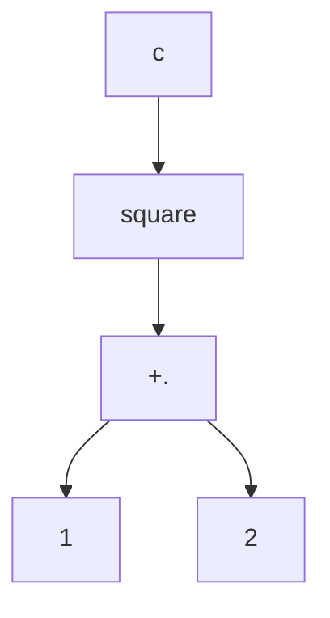
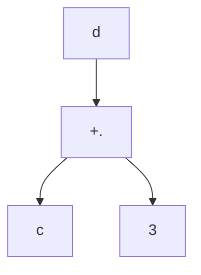
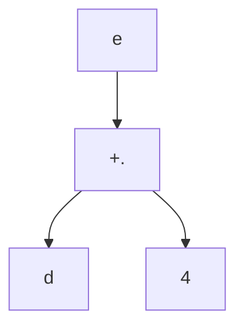

{: .note}
This lecture note covers the Data Palooza deck. 

## Table of Contents
{: .no_toc }

{:toc}
- dummy item

## Data Palooza
{: .no_toc }
In the next few lectures, we will be covering the internals of how many languages manage data (including types, variables and values). We won't be covering specific languages, but will instead look at patterns that occur across many languages. Before that, let's do a brief introduction of some of the terms we will be discussing.
## Variables and Values
A variable is the symbolic name associated with a location that contains a value or a pointer. A value is a piece of data with a type (usually) that is either referred to by a variable, or computed by a program. For a concrete example, consider the statement
```python
a = 42
```
Here `a` is a variable, and `42` is a value.

What are the facets that make up a variable?
- names: variables almost always have a name
- types: a variable may (or may not) have a type associated with it
- values: a variable stores a value (and its type)
- binding: how a variable is connected to its current value
- storage: the slot of memory that stores the value associated with the variable
- lifetime: the timeframe over which a variable exists
- scope: when/where a variable is accessible by code
- mutability: can a variable's value be changed?

What are the facets that make up a value?
- ~~names: variables almost always have a name~~
- types: a value **will always** have a type associated with it
- ~~values: a variable stores a value (and its type)~~
- ~~binding: how a variable is connected to its current value~~
- storage: the slot of memory that stores the value
- lifetime: the timeframe over which a value exists
- ~~scope: when/where a variable is accessible by code~~
- mutability: can a value be changed?

{: .note }
Lifetime and scope seem similar, but they are **not** the same. Lifetime refers to the *existence* of the variable, whereas scope refers to the *accessibility* of a variable. It is entirely possible for a variable to be out-of-scope but still be alive.

### Variable names
{: .no_toc }
What must a language designer consider when deciding variable naming rules for a language? There are multiple possible choices here, and there isn't one single correct answer.
- Almost all languages stipulate that names should contain valid characters
- Almost all languages stipulate that names should not be the same as keywords or constants
- Most languages have a rule that disallows spaces in variable names
- Some languages have rules about special characters in names, some enforce length restrictions, and some even enforce some sort of case sensitivity rule.

Practically, variable naming conventions are more important than the naming rules of languages. These conventions are usually designed to enforce some degree of standardisation across a codebase. A good example of a standard would be [Google's standard](https://google.github.io/styleguide/).

{: .note}
Why do most loops idiomatically use `i` or `j` for loop variables? It all goes back to Fortran, the first standardised programming langauge. Fortran had a quirky rule where if you didn't explicitly declare a variable type, it would the first letter of the name to determine the type. Variables starting from `a-h` and `o-z` defaulted to `floats`, while variables starting from `i-n` defaulted to `integers`.

### Variable storage
{: .no_toc }
Variables and values are stored in one of three different places: the stack, the heap or the static data area.


|  |
| :--: |
| Layout of program memory. Function parameters and local variables are stored on the stack. Variables dynamically allocated during runtime lie in the heap. Static members and globals are stored in the static data area. |

Usually local variables and function parameters are stored on the stack. Dynamically allocated objects and values are usually stored on the heap. Most languages store global and static variables in the static data area. Of course, you can also have combinations of these; for example, a pointer that is stored on the stack, but whose value lies on the heap.

### Variable types
{: .no_toc }
What can you infer about a value, given its type?
- The set of legal values it can hold
- The operations we can perform on it
- How much memory you need
- How to interpret the bytes stored in RAM
- How values are converted between types

### Variable lifetime and scope
{: .no_toc }
Every variable and value has a lifetime, over which they are valid and may be accessed. Note that it is possible for a variable to be "alive" during execution, and yet not be accessible. Some languages give the programmer explicit control over the lifetime of a value, while others completely abstract this away.
```cpp
void bar() {
  ...
}

int main() {
  int x = 5;
  bar();
  ...
}
```
A variable is in scope if it can be explicitly accessed by name in that region.
```cpp
void bar(int *ptr) {
  cout << x;    // ERROR! x isn’t in-scope here!
  cout << *ptr; // Even though its value can be accessed
}

void foo() {
  int x;
  cout << x;    // x is in-scope here
  bar(&x);
}
```
There are two primary approaches to scoping: lexical (or static) scoping and dynamic scoping. We will cover these topics in the next lecture.

### Variable binding
{: .no_toc }
As we've seen, different languages have different ways of binding variable names with values. For example a C++ variable name directly refers to the storage location holding it's value, while in Python, a variable holds an "object reference", which then in turn points to the actual value. We will cover the major binding approaches in detail later on.

### Mutability
{: .no_toc }
If a variable is immutable, then it's value cannot be changed once assigned, and vice versa if a variable is mutable. Most languages have some form of immutability. In C++, variables can be made immutable using the `const` keyword. In Haskell, all variables are by default immutable. Immutability might seem like it makes the language less flexible (and it does to some extent), it also allows for the program to be less buggy, and can also allow for some compiler optimisations to take place.

## Types

In this section, we will take a deep dive into typing and type checking. You should hopefully get a much better idea of the implications of a type system.

Before proceeding, it's worth asking if types are even necessary to create a programming language?

Actually, they're not! It is possible to have a language with no types. Assembly languages are one such example of languages with no type system. They just have a register that holds a 32 (or 64) bit value. The value could represent anything (an integer, float, pointer, etc.). [BLISS](https://en.wikipedia.org/wiki/BLISS) is another example of a language with no types.

```
MODULE E1 (MAIN = CTRL) =
BEGIN
FORWARD ROUTINE
    CTRL,
    STEP;
ROUTINE CTRL =
BEGIN
    EXTERNAL ROUTINE
        GETNUM,     ! Input a number from terminal
        PUTNUM;     ! Output a number to terminal
    LOCAL
        X,          ! Storage for input value
        Y;          ! Storage for output value
    GETNUM(X);
    Y = STEP(.X);
    PUTNUM(.Y)
    END;
ROUTINE STEP(A) =
    (.A+1);
END
ELUDOM
```

But virtually all modern languages have a type system, since it makes programming so much easier and safer.

Must every variable have a type in a typed language?

No! In Python for example, variables are not associated with types.

```python
# Python
def foo(q):
  if q:
    x = "What's my type?" # string
  ...
  x = 10 # int
```

In general, many dynamically typed[^1] languages don't associate variables with types. However, note that a value is **always** associated with a type.

[^1]: We'll get into exactly what it means to be dynamically typed later in this lecture!

Types can broadly be classified into two categories, primitive and composite. Primitive data types are a set of types from which other types are constructed. Composite data types are those types which can be constructed using primitive and composite data types.

Examples of primitive data types:

- Integers
- Booleans
- Characters
- Enumerated types (Enums)
- Floats
- Pointers

Examples of derived data types:

- Arrays
- Structs
- Variants/Unions
- Objects
- Tuples
- Containers

There can also be data types that don't fall into either category.

- Functions
- Generic types
- Boxed types

{: .note}
A boxed type is just an object whose only data member is a *primitive* (like an `int` or a `float`)

```cpp
class Integer {
 public:
   int get() const { return val_; }
 private:
   int val_;
};
```

In languages like Python that pass by object reference, this lets you "change" a primitive type's value!

### User Defined Types
{: .no_toc }
Beyond built in types like the ones discussed above, many languages also let users define new types themselves. For example, everytime you define a class, struct, enum, or interface, you're defining a new type. Note that the class itself is not a type, but its definition creates one.

### Supertypes and Subtypes
{: .no_toc }
As we learned in CS 32, some types exhibit a supertype/subtype relationship, where a subtype inherits properties and behaviours from its supertype. Typically, we define this type of relationship via inheritance, as follows:

```cpp
class Person {
public:
  virtual void eat()
    { cout << "Nom nom"; }
  virtual void sleep()
    { cout << "Zzzzz"; }
};

class Nerd: public Person {
public:
  virtual void study() 
   { cout << "Learn, learn, learn"; }
}; 
```


We can do the same via interface inheritance.

As discussed earlier, each type is associated with a specific set of operations. Any subtype of that type inherits ALL of the operations of its supertype, and may define additional operations on top of that. Not only do we define a type relationship, but we also implicitly define an operational relationship!

These relationships allow languages to determine operational compatibility between types, supporting things like type casting and polymorphism.[^2]

[^2]: Both of which we will get into later in the class!

### Value Types and Reference Types
{: .no_toc }

Types come in two flavors:
1. **Value Types**: a type that can be used to directly instantiate objects/values, as well as define pointers/object references/references
2. **Reference Types**: a type that can only be used to define pointers/object references/references, but *cannot* directly instantiate objects/values

An example of a value type is a concrete class like the following:

```cpp
class Dog {
public: 
  Dog(string n) { name_ = n; }
  void bark() { cout << "Woof\n"; }
private:
  string name_;
};
```
We can use it to instantiate a `Dog` object (and define pointers etc.).
```cpp
Dog d("Kuma"), *p;
```

An example of a reference type is one associated with an abstract class like the following:

```cpp
class Shape {
public: 
  Shape(Color c) { color_ = c; }
  virtual double area() = 0; 
private:
  Color color_;
};
```

We're not allowed to direclty instantiate an object...
```cpp
Shape s; // doesn't work!
```

...but we can create pointers.

```cpp
Shape *s;
```

### Type Equivalence
{: .no_toc }

Type equivalence is the criteria by which a programming language determines whether two values or variables are of equivalent types.

There are two approaches:
1. **Name Equivalence**: Two values/variables are of equivalent types only if their type names are identical.
2. **Structural Equivalance**: Two values/variables are of equivalent types if their structures are identical, regardless of their type name.

A language can choose either approach. For example, C++ uses name equivalence:

```cpp
// C++: name equivalence
struct S { string a; int b; };
struct T { string a; int b; };

int main() { 
   S s1, s2;
   T t1, t2;
   s1 = s2; // this works! 
   s1 = t1; // type mismatch error!
}
```

...while Typescript uses structural equivalence:

```ts
/ typescript: structural equiv.
type S = { a: string; b: number };
type T = { a: string; b: number };

function main() {
  let s1, s2 : S;
  let t1, t2 : T;
  s1 = s2; // this works!
  s1 = t1; // this works too!
}
```

In general, most statically typed languages (C++, Java, ...) use name equivalence while most dynamically typed languages (Python, JS) use structural equivalence. As we go through the various typing systems, look out for the two approaches!


## Type checking

Type checking is the process of verifying and enforcing constriants on types. Type checking can occur during compile time (static) or during run time (dynamic). The language can also specify the degree of strictness for type checking (strong and weak type checking). We will go into more detail on all of these topics.

|  |
| :--: |
| Type checking approaches. Type checkers can be classified on the basis of whether they run during compile time or during run time. Type checkers can also be classified on the basis of strictness (strong or weak). |

### Static typing

Static typing is the process of verifying that all operations in a program are consistent with the types of the operands prior to program execution. Types can either be explicitly specified (like in C++) or can be inferred from code (like in Haskell). For inferred types, if the type checker cannot assign distinct types to all variables, functions, and expressions or cannot verify type safety, then it generates an error.
But if a program type checks, then it means the code is (largely) type safe, and few if any run time checks need to be performed.

{: .note }
To support static typing, a language **must have** a fixed type bound to each variable at the time of definition.

#### Type Inference
{: .no_toc }

Type inference refers to the automatic detection of types of expressions or variables in a language. Consider the following example:

```cpp
void foo(_____ x, _____ y) {
  cout << x + 10;
  cout << y + " is a string!";
}
```

What would be the types of `x` and `y`? `int` and `string`, right! The compiler can infer that `y` is an `string` from the fact that we perform the operation `y + " is a string"`, which is only valid if `y` is a `string`. What about `x`? It seems like `x` can only be an `int`. But consider this example:

```cpp
void foo(_____ x, _____ y) {
  cout << x + 10;
  cout << y + " is a string!";
}
void bar() {
  double d = 3.14;
  foo(d,"barf");
}
```
Here, it makes more sense for `x` to be a `double`. So type inference is actually a complex constraint satisfaction problem.

Many statically typed languages now offer some form of type inference. C++ has the `auto` keyword:

```cpp
// C++ type inference with auto
int main() {
  auto x = 3.14159; // x is of type int
  vector<int> v;
  ...

  for (auto item: v) { // item is of type int
    cout << item << endl;
  }

  auto it = v.begin(); // it is of type vector<int>::iterator
  while(it != v.end()) {
    cout << *it << endl;
    ++it;
  }
}
```

{: .note }
Type inference has limitations! Most languages (like C++, Java, or Rust) will struggle with generic types and iterators; you'll be forced to write type annotations in some areas.

Go similarly infers the type of variables from the right-hand-side expression
```go
// GoLang type inference
func main() {
  msg := "I like languages"; // string
  n := 5 // int
  for i := n; i > 0; i-- {
    fmt.Println(msg);
  }
}
```

#### Conservatism
{: .no_toc }

Static type checking is inherently conservative. This means that the static type checker will disallow perfectly valid programs that never violate typing rules.

{: .note }
This is due to the fact that for Turing-complete languages, it is not possible to have a *sound* (meaning all incorrect programs are rejected), *decidable* (meaning that it is possible to write an algorithm that determines whether a program is well-typed), and *complete* (meaning no correct programs are rejected) type system. This follows from [Gödel's incompleteness theorems](https://en.wikipedia.org/wiki/G%C3%B6del%27s_incompleteness_theorems). (Don't worry if you don't understand this, it won't be on the exam :))

For an example, consider the following program:

```cpp
class Mammal {
public:
 virtual void makeNoise() { cout << "Breathe\n"; }
};
class Dog: public Mammal {
public:
 void makeNoise() override { cout << "Ruff\n"; }
 void bite() { cout << "Chomp\n"; }
};
class Cat: public Mammal {
public:
 void makeNoise() override { cout << "Meow!\n"; }
 void scratch() { cout << "Scrape!\n"; }
};

void handlePet(Mammal& m, bool bite, bool scratch) {
 m.makeNoise();
 if (bite)
   m.bite();
 if (scratch)
   m.scratch();
}

int main() {
 Dog spot;
 Cat meowmer;
 handlePet(spot, true, false);
 handlePet(meowmer, false, true);
}
```

The compiler generates an error during the compilation of this code
```console
error: no member named 'scratch' in 'Mammal'
```

even though the code only asks `Dog`s to `bite` and `Cat`s to `scratch`.

**Pros of static type checking**:

- Produces faster code (since we don't have to type check during run time)
- Allows for earlier bug detection (at compile time)
- No need to write custom type checks

**Cons of static type checking**:

- Static typing is conservative and may error our perfectly valid code
- It requires a type checking phase before execution, which can be slow

### Dynamic typing

Dynamic type checking is the process of verifying the type safety of a program at run time. If the code is attempting an illegal operation on a variable's value, an exception is generated and the program crashes. Here are some examples of dynamic type checking at run time.

```python
def add(x,y):
 print(x + y)

def foo():
 a = 10
 b = "cooties"
 add(a,b)
```

outputs

```console
TypeError: unsupported operand type(s) for +: 'int' and 'str'
```

```python
def do_something(x):
 x.quack()

def main():
 a = Lion("Leo")
 do_something(a)
```

outputs

```console
AttributeError: 'Lion' object has no attribute 'quack'
```

Most dynamically typed languages don't require explicit type annotations for variables. This means that a given variable name could refer to values of multiple types over the course of execution of the program.

```python
def guess_my_number(secret_value):
 val = get_number_from_user()

 if val > 100:
   val = "Your guess is too large!"
 else:
   ...
```

#### Type Tags
{: .no_toc }

How does a program written in a dynamically typed language detect type violations?

Well, in dynamically typed languages, **types are associated with values -- not variables**! In other words, variables do not have types in dynamically typed languages.

Usually the compiler/interpreter would use a *type tag*, an extra piece of data stored along with each value that indicates the type of the value.

```python
def add(x,y):
 print(x + y)

def foo():
 a = 10
 b = "cooties"
 add(a, b)
```

So in this example, the compiler would store the fact that the value `a` is pointing to is an `int` with value `10`, and `b` is a `string` with value `cooties`.

Sometimes statically typed languages also need to perform run time type checks. This is most often seen during down-casting (when casting an object from a child class to a parent class). Consider the following example.

```cpp
class Person { ... };
class Student : public Person { ... };
class Doctor : public Person { ... };
void partay(Person *p) {
  Student *s = dynamic_cast<Student *>(p);
  if (s != nullptr)
    s->getDrunkAtParty();
}
int main() {
  Doctor *d = new Doctor("Dr. Fauci");
  partay(d);
  delete d;
}
```

`dynamic_cast` does a run time check to ensure that the type conversion (from `Person*` to `Student*`) we are performing is valid. If it isn't valid, `dynamic_cast` will return `nullptr`.

**Pros of dynamic type checking**:
- Increased flexibility
- Often easier to implement generics that operate on many different types of data
- Simpler code due to fewer type annotations
- Makes for faster prototyping

**Cons of dynamic type checking**:
- We detect errors much later
- Code is slower due to run time type checking
- Requires more testing for the same level of assurance
- No way to guarantee safety across all possible executions (unlike static type checking)

#### Addendum: Dynamic Type Checking in Statically-Typed Languages
{: .no_toc }

Sometimes, dynamic type checking is needed in statically-typed languages:

- when downcasting (in C++)
- when disambiguating variants (think Haskell!)
- (depending on the implementation) potentially in runtime generics

#### Duck Typing
{: .no_toc }

Duck typing emerges as a consequence of dynamic typing. With static typing, we determine the what operations work on a particular value/variable based on the type of the value/variable. But a consequence of dynamic typing is that variables no longer have a fixed type. This means that we can pass a value of any type to a function, and as long as the type of the value implements all of the operations used in the function, the code should work fine.

Consider the following example:

```python
# Python "duck" typing
class Duck:
 def swim(self):
  print("Paddle paddle paddle")

class OlympicSwimmer:
 def swim(self):
  print("Back stroke back stroke")

class Professor:
 def profess(self):
  print("Blah blah blah blah blah")

def process(x):
 x.swim()

def main():
 d = Duck()
 s = OlympicSwimmer()
 p = Professor()
 process(d) # Paddle paddle paddle
 process(s) # Back stroke back stroke
 process(p) # throws AttributeError
```
Since `Duck` and `OlympicSwimmer` both implement the `swim` method, the code works. When it gets to `Professor`, which doesn't implement `swim`, that's when you get the error.

The values you pass to `process` only need to implement `swim`, they do not have to be related to each other. Duck typing has some interesting applications.

#### Supporting enumeration
{: .no_toc }

In Python, you can make any class iterable by just implementing the `__iter__` and `__next__` methods.
```python
# Python duck typing for iteration
class Cubes:
  def __init__(self, lower, upper):
    self.upper = upper
    self.n = lower
  def __iter__(self):
    return self
  def __next__(self):
    if self.n < self.upper:
      s = self.n ** 3
      self.n += 1
      return s
    else:
      raise StopIteration

for i in Cubes(1, 4):
  print(i)             # prints 1, 8, 27
```

#### Make any class printable!
{: .no_toc }

In Python, you can make any class printable (using `print`) by just implementing the `__str__` function
```python
# Python duck typing for printing objects
class Duck:
 def __init__(self, name, feathers):
  self.name = name
  self.feathers = feathers

 def __str__(self):
  return self.name + " with " + \
         str(self.feathers) + " feathers."

d = Duck("Daffy", 3)
print(d)
```

#### Make any class comparable!
{: .no_toc }

In Python, if you add the `__eq__` method to any class, you can make it's objects "comparable".

```python
# Python duck typing for equality
class Duck:
  def __init__(self, name, feathers):
    self.name = name
    self.feathers = feathers

 def __eq__(self, other):
  return (
    self.name == other.name and
    self.feathers == other.feathers
  )

duck1 = Duck("Carey", 19)
duck2 = Duck("Carey", 19)

if duck1 == duck2:
  print("Same!")
```

Other dynamically typed languages also offer duck typing!

**Ruby**:

```ruby
# ruby duck typing
class Duck
 def quack
  puts "Quack, quack"
 end
end

class Dog
 def quack
  puts "Woof... I mean quack!"
 end
end

animals = [Duck.new,Dog.new]
animals.each do |animal|
 animal.quack()
end
```

**JavaScript**:
```js
// JavaScript duck typing
var cyrile_the_duck = {
  swim: function ()
          { console.log("Paddle paddle!"); },
  color: "brown"
};

var michael_phelps = {
  swim: function ()
          { console.log("Back stroke!"); },
  outfit: "Speedos"
};

function process(who) {
  who.swim();
}

process(cyrile_the_duck);  // Paddle paddle!
process(michael_phelps);   // Back stroke!
```

{: .note }
It is possible to have something similar to duck typing in statically typed languages (like C++) as well. In C++, this is done using templates; there's also runtime generics in Java, Rust's generics system, etc.

### Gradual Typing

Gradual typing is a hybrid approach between static and dynamic typing. It's used by a few well known languages like PHP and TypeScript, so it merits discussion.

In gradual typing, some variables may have explicitly annotated types, while others may not. This allows the type checker to partially verify type safety prior to execution, and perform the rest of the checks during run time.

With gradual typing, you can choose whether to specify a type for variables/parameters. If a variable is untyped, then type errors for that variable are detected at run time. But if a variable is typed, then it's possible to detect some type errors at compile time. But what if we pass an untyped variable as an argument to a typed variable? Look at the following code snipped for a concrete example.

```python
def square(x: int):
  return x * x

def what_happens(y):
  print(square(y))
```

This is actually allowed in gradually typed languages! If you pass an untyped variable as an argument to `what_happens`, the type checker will check for errors during run time. This way, if you do use an invalid type, the program will generate an error the moment an incompatible type is detected.

### Classify That Language: Type Checking
{: .no_toc }

Let's try and classify a language.
```kotlin
fun greet(name: String) {
  print("Hello, $name!")
}

fun main() {
  var n = "Graciela";
  greet(n);

  n = 10;
}
```

Is this language dynamically, statically or gradually typed, given that the code generates the following error?

```console
The integer literal does not conform to the expected type String
```

**Answer**: Even though it doesn't look like it at first glance, the language is statically typed, since you can't assign `n` to a value of a new type. This means that `n` has a fixed type, and that the language is using type inference. This language is actually Kotlin!


### Strong typing

Now that we have a good idea of static and dynamic typing, we're going to look at the various type checking approaches on the basis of strictness. A strongly typed language ensures that we will **never** have *undefined behaviour* at run time due to type issues. This means that in a strongly typed language, there is no possibility of an unchecked run time type error.

{: .note }
The definition of strong typing is disputed. Many academics argue for a stronger definition (e.g. all conversions between types should be explicit, the language should have explicit type annotations for all variables, etc.). But ultimately while these definitions may make a languages type system stricter, they don't impact the languages type or memory safety.

These are the minimum requirements for a language to be strongly typed:

- **the language is type-safe**: the language will prevent an operation on a variable `x` if `x`s type doesn't support that operation.
```cpp
int x;
Dog d;
a = 5 * d; // Prevented
```
- **the language is memory safe**: the language prevents inappropriate memory accesses (e.g., out-of-bounds array accesses, accessing a dangling pointer)
```cpp
int arr[5], *ptr;
cout << arr[10]; // Prevented
cout << *ptr; // Prevented
```

These can be enforced either statically or dynamically!

Languages usually use a few techniques to implement strong typing:
- before an expression is evaluated, the compiler/interpreter validates that all of the operands used in the expression have compatible types.
- all conversions between different types are checked and if the types are incompatible (e.g., converting an int to a Dog), then an exception will be generated.
- pointers are either set to null or assigned to point at a valid object at creation.
- accesses to arrays are bounds checked; pointer arithmetic is bounds-checked.
- the language ensures objects can't be used after they are destroyed.

In general, strongly typed languages prevent operations on incompatible types or invalid memory.

#### Why do we need memory safety?
{: .no_toc }
Why do strongly typed langauges require memory safety? To answer this question, consider the following example in C++ (a weakly typed language).
```cpp
// C++
int arr[3] = {10, 20, 30};
float salary = 120000.50;

cout << arr[3]; // out-of-bounds access
```
`arr[3]` actually access the value stored in `salary`, since all local variables are stored on the stack. So if a language is not memory safe, then it's possible to access a value (like `salary`) using an invalid type (`int` instead of `float`). Accessing a dangling pointer is another example of how memory safety can violate type safety.

|  |
| :--: |
| In C++, `arr[3]` would actually access the value stored in `salary` as if it were an integer! |

```cpp
// Accessing a dangling pointer
float *ptr = new float[100];
delete [] ptr;
cout << *ptr; // is this still a float?
```

#### Checked type casts
{: .no_toc }
A checked cast is a type cast that results in an exception/error if the conversion is illegal. Let's look at a concrete example in Java, a strongly typed language.
Consider the following snippet of code.
```java
public void petAnimal(Animal a) {
  a.pet(); // Pet the animal

  Dog d = (Dog)a; // Probably a dog, right?
  d.wagTail();    // It'll wag its tail!
}

...

public void takeCareOfCats() {
  Cat c = new Cat("Meowmer");
  petAnimal(c);
}
```
In this case, the program would output a type error saying that `Cat` can't be type cast to `Dog`.
```console
java.lang.ClassCastException: class Cat cannot be cast to class Dog
```
A similar snippet of code in C++ however would run, even though we are dealing with an object of type `Cat`, not `Dog`!
```cpp
void petAnimal(Animal *a) {
  a->pet(); // Pet the animal

  Dog* d = (Dog *)a;
  d->wagTail();
}

...

void takeCareOfCats() {
  Cat c("Meowmer");
  petAnimal(&c);
}
```
When the C++ program actually executes `d->wagTail()`, anything could happen. This is *undefined behaviour* (we will cover undefined behaviour later in this lecture).

Why should we prefer strongly typed languages? Well, they have two main benefits.
- They dramatically reduce software vulnerabilities (e.g. buffer overflows).
- They allow for early detection and fixing of errors/bugs.

{: .note }
The definition of strong typing is disputed. Many academics argue for a stronger definition (e.g. all conversions between types should be explicit, the language should have explicit type annotations for all variables, etc.). But ultimately while these definitions may make a languages type system stricter, they don't impact the languages type or memory safety.

### Weak typing
Weak typing is essentially the opposite of strong typing, in that it **does not** guarantee that all operations are invoked on objects/values of the appropriate type.
Weakly typed languages are generally neither type safe nor memory safe.

#### Undefined behaviour
{: .no_toc }
In a strongly typed language, we know that all operations on variables will either succeed or generate an explicit type exception at runtime (in dynamically-typed languages). But in weakly-typed languages, we can have undefined behavior at runtime!

Undefined behaviour is the result of executing a program whose behaviour is prescribed as unpredictable in the language spec.
Consider the following example in C++.
```cpp
// C++ example w/undefined behavior!
class Nerd {
public:
  Nerd(string name, int IQ) { ...}
  int get_iq() { return iq_; }
  ...
};

int main() {
  int a = 10;
  Nerd *n = reinterpret_cast<Nerd *>(&a); // reinterpret the integer as a Nerd object
  cout << n->get_iq(); // ?? What happens?!?!?
}
```
When we call the `get_iq` method on `n` (which is actually an `integer`), the program is going to crash!

It's tough to say whether or not a language is weakly or strongly typed just from looking at its behaviour in one situation. Consider the following example from a mystery language.
```perl
# Defines a function called ComputeSum
# In this language, @_ is an array that holds
# all arguments passed to the function

sub ComputeSum {
   $sum = 0;

   foreach $item (@_) {    # loop thru args
      $sum += $item;
   }

   print("Sum of inputs: $sum\n")
}

# Function call
ComputeSum(10, "90", "cat");
```
This outputs
```console
Sum of inputs: 100
```
It may seem like the mystery language is weakly typed, but in fact the mystery language is Perl, which is strongly typed!

Weak typing is the situation where an undefined result occurs because we apply some operation to a type that does not support it.  

In Perl, the `+` operator does support the `string` type. It will convert the `string` to an `integer`, if possible (e.g., if it holds all digits). If not, it'll convert the `string` to a value of zero. Then it'll perform the add. 

So while Perl does perform implicit conversions which might not do what you want, its behavior is **never undefined**.

### Classify that Language: Type Checking
{: .no_toc }
Consider the following program which generates a runtime error:

```kotlin
fun processArgBasedOnType(x: Any) {
  when (x) {
    is Int -> print(x)
    is String -> print(x.length)
    is IntArray -> print(x.sum())
    else -> print((x as Dog).bark())  
  }
}

fun main() {
  var x = Person("Carey","Nachenflopper");
  processArgBasedOnType(x)   
}
```

Is this language strongly typed or weakly typed? Is it possible to determine if its statically typed or dynamically typed?

This is the error that is generated:
```console
Run-time: class Person cannot be cast to class Dog
```

<details>
<summary> Answer </summary>
It's strongly typed! We are prevented from performing an invalid cast from `Person` to `Dog`.
<br><br>
We are also able to determine that it's statically typed. In a dynamically typed language, a cast would not be necessary. This is Kotlin!
</details>

You might be wondering now: which typing strategy is best? The trend in industry is toward more **strongly-typed** langauges with **static type checking**. In fact, many companies are developing versions of popular dynamically typed languages with static type checking.
- Facebook has developed hack, a strongly and statically typed version of PHP
- they have also developed Flow, a static type checker for Javascript
- Microsoft has developed TypeScript, a strongly and gradually typed version of Javascript

In fact, just about the only weakly typed languages left are C and C++.


## Type casting, conversion and coercion

Type casting, conversion and coercion are different ways of explicitly or implicitly changing a value of one data type into another. 

For example, we can change the type of a variable using `static_cast` in C++.
```cpp
void convert() {
  float pi = 3.141;
  cout << static_cast<int>(pi); //type conversion
}
```

Before diving into the details of casting and conversion, it helps to learn the concepts of supertypes and subtypes.

### Subtypes and Supertypes
Often the types you are converting will be related to each other, for instance like `float` and `double`. Both types semantically represent real-valued numbers, but:
- `double` can hold every value a `float` can hold and more, due to having a relatively higher precision.
- any operation (e.g., +, -, *, /) you can perform on `double`s you can also perform on `float`s (but not necessarily vice versa)

So in language theory, we say that `float` is a subtype of `double`, or alternatively that `double` is a supertype of `float`.

More formally, given two types T<sub>sub</sub> and T<sub>super</sub>, we say that T<sub>sub</sub> is a subtype of T<sub>super</sub> if and only if
1. every element belonging to the set of values of type T<sub>sub</sub> is also a member of the set of values of T<sub>super</sub>.
2. _All_ operations (eg +, -, *, /) that you can use on a value of type T<sub>super</sub> must also work properly on a value of type T<sub>sub</sub>.
 - i.e., If I have code designed to operate on a value of type T<sub>super</sub>, it must also work if I pass in a value of type T<sub>sub</sub>.

{: .note}
Another way of thinking about this could be like two toddlers bragging on a playground:
Imagine the supertype saying:"Anything you can be, I can be" and the subtype saying:"Anything you can do, I can do".

Does this mean `float` is a subtype of `double` in C++? Yes! Since all operations that can be performed on a `double` can also be performed on an `float` (+, -, \*, /, etc.) **and** every `float` value is also in the set of `double` values.

{: .note}
To clear up the discussion from class about the type relations of `int` with either `float` or `double`:
`int` is NOT a subtype of `float` but `int` IS a subtype of `double` since `double`s have enough precision to represent all values that `int` can hold.

What about this example?
```cpp
class Person {
public: 
  virtual void eat();
  virtual void sleep();
};

class Nerd: public Person {
  virtual void eat();
  virtual void sleep();
  virtual void study();
};
```
Is `Nerd` a subtype of `Person`? Yes, since all operations that can be performed on a `Person` can also be performed on a `Nerd` **and** all `Nerd`s belong to the set of `Person`s. 

For a more tricky example, is `int` a subtype of `const int`? Yes, because all operations that can be performed on a `const int` can also be performed on an `int` and `int` and `const int` have the same set of values.

### Switching between types
{: .no_toc }
Type conversion and type casting are used when we want to perform an operation on a value of type A, but the operation requires a value of type B.
There are two ways of switching between types - *conversions* and *casts*

### Type conversions
A conversion takes a value of type A and generates a whole new value (occupying new storage, with a different bit encoding) of type B.
Type conversions are typically used to convert between primitives (e.g. float and int).

```cpp
void convert() {
  float pi = 3.141;
  cout << (int)pi; // 3
}
```
This is a conversion since the compiler generates a new temporary value of a different type.

### Type casts
A cast takes a value of type A and treats it as if it were value of type B – no conversion takes place! No new value is created!

Type casts are typically used with objects.

```cpp
// Another casting example; treat an
// int as if it's an unsigned int!


int main() {
  int val = -42;

  cout << (unsigned int)val;
      // prints 4294967254
}
```
In the above example, `val` refers to the original `int` object, but interprets the bits as if it were an `unsigned int`.

Conversions and casts can be *widening* or *narrowing*.
- Widening means the target type is a super type, and can fully represent the source type's values.
- Narrowing means the target type may lose precision or otherwise fail to represent the source type's values. The target type could be a subtype (like `long` and `short`), or the two types could also have a non-overlapping set of values (like `unsigned int` and `int`).

Conversions and casts can also be *explicit* or *implicit*.
- An explicit conversion requires the programmer to use explicit syntax to force the conversion/cast
- An implicit conversion (also called coercion) is one which happens without explicit conversion syntax.

{: .note }
An implicit conversion or cast that is widening is called a *type promotion*.

### Explicit conversions and casts
{: .no_toc }
When you're using an explicit conversion or cast, you're telling the compiler to change what would be a compile time error to a run time check.
```java
class Example
{
  public void askToCookFavoriteMeal(Machine m) {
    if (m.canCook() && m.canTalk()) {
      RobotChef r = m; // Line 5
      r.requestMeal("seared ahi tuna");
    }
  }
}
```
For example, at line 5, the programmer may know that converting from `Machine` to `RobotChef` is always safe, but a statically typed compiler can't know that. Therefore, the compiler will output an error. With an explicit cast (like in the example below), the compiler knows that the programmer wants to do this, and allows the code to compile.
```java
class Example
{
  public void askToCookFavoriteMeal(Machine m) {
    if (m.canCook() && m.canTalk()) {
      RobotChef r = (RobotChef)m; // Line 5
      r.requestMeal("seared ahi tuna");
    }
  }
}
```
If the language is strongly typed, then it will perform a runtime check to ensure the type conversion is valid. In weakly typed languages, however, improper casts/conversions are often not checked at run time, leading to nasty bugs!

Here are a few examples of explicit type conversions in different languages.
- C++
```cpp
// Explicit C++ conversions
float fpi = 3.14;
int ipi = (int)fpi;               // old way
int ipi2 = static_cast<int>(fpi); // new way
RobotCook *r = dynamic_cast<RobotCook *>(m);
```

{: .note }
Confusingly, even though `static_cast<int>(fpi)` is creating a new value (so it's performing a conversion), C++ calls it a cast

- Python
```python
# Explicit Python conversions
fpi = 3.14
ipi = int(pi)
```

- Haskell
```hs
-- Explicit Haskell conversion
fpi = 3.14 :: Double
ipi = floor(foo)     -- converts to 'Integral' super type
```

- JavaScript
```js
-- Explicit JavaScript conversion
fpi = 3.14
ipi = parseInt(pi) -- converts to int
```

### Implicit conversions and casts
{: .no_toc }
Most languages have a set of rules that govern implicit conversions that may occur without warnings/errors. For instance, the slides have some associated with C/C++. When learning a new language, it helps to understand its implicit conversion policy!

Let's look at some examples of implicit conversions and casts in different languages.

- C++

```cpp
// Implicit C++ conversions
void foo(double x) { ... }

int main() {
  bool b = true;
  int i = b;  // b promoted to int
  double d =
    3.14 + i; // i promoted to double
  i = 2.718;  // 2.718 coerced/narrowed to int
  foo(i);     // i promoted to double
}
```

When we promote `i` to `double` in the statement `double d = 3.14 + i;`, it brings the all of the operands to a common super type so that addition can be performed. In such an expression with mixed types, the types of all variables must have "type compatibility" with each other.

{: .note }
In the above example, `i` is still an `int`, and it's value is `2`, not `2.718`. Compilers (especially recent ones) will often generate warnings for narrowing coercions which may not preserve the full source value.

- Python

```python
# Implicit Python conversions
i = 123 + True  # True promoted to int  (124)
f = 1.23
sum = i + f     # i promoted to float
```

- JavaScript

```js
// Implicit JavaScript conversion
str = "sk" + 8   // coercion of 8 to string
n = "10" * "15"  // coercion to numbers
```

- Java

```java
// Implicit (un)boxing in Java
int i = 10;
// implicit boxing
Integer boxed_i = i;
// implicit unboxing
int unboxed_i = boxed_i;
```

{: .note }
Haskell doesn't do implicit type conversions.

### Type casting in depth
Casting is when we reinterpret the bits of the original value in a manner consistent with a different type. No new value is created by a cast, we just interpret the bits differently. The most common type of casting is from a subtype to a supertype, for example, when upcasting from a subclass to a super class to implement polymorphism. Downcasting is another example, where we go from a super class to a subclass.
```cpp
// C++
class Mammal { ... }
class Person : public Mammal { ... };
class Nerd: public Person { ... };

void ask_hobbies(Person &p) { ... }

void date_with_nerd(Nerd &n) {
  ask_hobbies(n); // upcast Nerd to Person
}

void date_with_mammal(Mammal &m) {
 // downcast Mammal to Person
 Person& p = dynamic_cast<Person &>(m);
 ask_hobbies(p);
}
```
Here is an example of implicit casting.
```cpp
// C++
void print(unsigned int &val)
 { cout << val << endl; }

int main() {
   int j = -42;

   print(j);  // prints 4294967254
}
```
This cast simply reinterprets the value stored by `j` as if it were an `unsigned int`.

{: .note }
Many compilers will *not* warn about implicit casts when they are between unsigned and signed types - even though they are narrowing.

```cpp
// C++
void print(const string &s)
 { cout << s << endl; }

int main() {
   string s = "UCLA";

   print(s);
}
```
This cast implicitly converts from type `string` to `const string`.

We can also use casting to change the interpretation of pointers and read/write memory using a different type. For example, consider the following snippet of code in C++.
```cpp
void cast() {
  int a = 1078530000;
  int *ptr = &a;
  // Treat ptr as a float *
  cout << *reinterpret_cast<float *>(ptr); // prints 3.14159
}
```
The code treats `ptr` as if it is a pointer to a `float` (using `reinterpret_cast`), and when we dereference ptr, the bits are interpreted as if they were a `float`.

We can also reinterpret the value of an integer as a pointer (though this isn't recommended).
```cpp
void cast() {
  int a = 12340;
  // Treat a as a double pointer
  // Store value of pi at address 12340!
  *reinterpret_cast<double *>(a) = 3.14159;
}
```
So what's better, explicit or implicit type conversions? It depends! Explicit type conversions lead to more verbose code and is less convenient, but reduces the likelihood of bugs. Implicit type conversions makes code less verbose and is more convenient, but greatly increases the likelihood of bugs.

Here are a few final examples of casting and conversions.
```perl
$a = 5;
if ($a) {
    print("5 is true!");
}
```
From this snippet of code, we can infer that the language supports type coercion, since it does a narrowing coercion from an integer value `5` to a boolean value `false`.

{: .note }
The language is actually Perl.

In the following example, we are told that the program doesn't work if we remove the `float32` conversion.
```go
func main() {
  var x int = 5
  var y float32 = 10.0
  var result float32

  result = float32(x) * y // doesn't work if we remove float32()
  fmt.Printf("5 * 10.0 = %f\n", result)
}
```
From this, we can infer that the language requires explicit conversions between even comparable types (like `int` and `float`).

{: .note }
The language is actually Golang.

To summarize:
- conversion always generates a new value of the new type based on the old value 
- a cast takes the memory of a variable of type A and reinterprets it as type B
- there are three key properties of conversions/casts
    1. explicit or implicit
    2. widening or narrowing
    3. checked or unchecked

Here's a handy chart to help out with all the terminology!
  

## Scoping

The **scope** of a variable is the part of a program where a variable is valid (i.e., can be accessed). The parts can be lines, statements, expressions, instructions, or other units!

A variable is **"in scope"** in a part of a program if it is *currently* accessible by name.

For this example,

```cpp
void foo() {
  int x;
  cout << x;
}
```

we'd say:

- "The scope of the `x` variable is the function `foo()`."
- "The x variable is in scope within the `foo` function because it is defined at the top of the function."

**Scoping strategies** describe when variables are in-scope!

Here's a simple example from C++:

```cpp
void foo() {
  int x;
  cout << x; // Just fine, x is in foo’s scope!
}

void bar() {
  cout << x; // ERROR! x isn’t in bar’s scope!
}
```

C++ uses a lexical scoping strategy that scopes to blocks (we'll explain this soon).

### Lexical Environments
{: .no_toc }

Here's a slightly more in-depth example:

```cpp
string dinner = "burgers";     // this variable's scope is global - it's in scope everywhere

void party(int drinks) {       // drinks is in scope for the entire party() function
  cout << "Partay! w00t";
  if (drinks > 2) {
    bool puke = true;          // bool is only in scope for this if statement
    cout << "Puked " << dinner;
  }
}

void study(int hrs) {          // hrs is in scope for the entire study() function; but, not the same hrs as main()!
  int drinks = 2;              // drinks is also in scope for study(); but, not the same drinks as party()!
  cout << "Study for " << hrs;
  party(drinks+1);
}

int main() {
  int hrs = 10;                // this hrs is only in scope in main(); different from the hrs in study()!
  study(hrs-1);
}
```

Functions have their own scope too: they are defined immediately after they're declared.

As the program runs, it maintains a **lexical environment**: a tracker of what's in scope and what's not!

- for example, in the `main()` function, the lexical environment only contains the variable `hrs` and the three functions `main()`, `study()`, and `party()`
- but, once we call `study(hrs-1)` and enter a new environment, the lexical environment changes: we get a different `hrs` (the one in the argument), as well as a new variable `drinks`
- for a full trace, play through the animations on slide 83!

Many languages have *slightly different* scoping strategies! Differences include:

- how do constructs like functions, control flow (if statements, loops), or classes affect varaible scope?
- what do you do if you try to define a new variable with a name that already exists?
- when does a variable's scope end?

By the end of this section, we'll know how to answer these questions for all sorts of functions :)

### Lifetime

There is one related but different concept: a lifetime.

A variable's **lifetime** describes when a variable can be accessed. It includes times when the variable is in scope, but also times where it's not in scope (but can be accessed indirectly).

Values also have lifetimes. Variables and the values they point to can have different lifetimes!

Take a look at our previous example, but slightly modified:

```cpp
void study(int how_long) {
  while (how_long-- > 0)
    cout << "Study!\n";
  cout << "Partay!\n";
}

int main() {
  int hrs = 10;
  study(hrs);
  cout << "I studied " << hrs <<
        " hours!";
}
```

The scope of `hrs` is only within `main()`; when we call into `study`, we can no longer access it. But, **its lifetime also extends to `study()`**, since we can access it indirectly - through the variable `how_long`!

Python lets you manually end a variable's lifetime early:

```py
def main():
  var = "I exist"
    ...
  del var    # no longer exists!
  print(var) # error!
```

### Lexical Scoping

Lexical scoping is the most-used scoping paradigm (almost all languages you've used use it). The core tenet has to do with how your code is organized, which we'll call the **context** that a variable is defined in. If we can't find the variable in the current context, we'll go to the enclosing context - until we run out (and hit the global context).

More strictly, languages like Python use the **LEGB** rule. We look for a variable in this order:

1. First, look at the **local scope**. In Python, this is either an expression or a function.
2. If it's not there, look at successive **enclosing scopes**. Repeat this until...
3. You hit the **global scope**.
4. If it's still not there, look at the **built-in scope** - this contains things like `print`

Importantly, once a context is over, the variables in that context can't be accessed!

To get a feel of lexical scoping, let's go through a few examples.

In Python, one context type is an **expression**:

```py
sum([x*x for x in range(10)])     # this works :)
sum([x*x for x in range(10)] + x) # x isn't in scope!
```

In this example, `x` is defined in the context of an **expression** (a list comprehension). Its scope is only in that expression!

In C++, one context type is a **block** (roughly: any set of braces, `{` and `}`):

```cpp
if (drinks > 2) {
  int puke = 5;
  // ...
}
cout << puke; // error - puke is not in scope!
```

Note that Python does not scope with respect to blocks!

```py
def a():
  if True:
    x = 5
  print(x) # this works!
```

However, both Python and C++ scope to **functions**:

```py
def a():
  x = 5

print(x) # error - x is out of scope!
```

```cpp
void snore(int n) {
  int i = 0;
  while (i++ < n){ /* */}
}
cout << i; // error - i is not in scope!
```

Other relevant scoping constructs include:

- classes: think about private functions and member variables!
- namespaces: think about `using namespace std;` versus having to type out `std::cout`
- the **global** scope: the last resort!


### Shadowing

When a variable is redefined in a different context, lexical scoping languages typically use an approach called **shadowing**. In an inner context, the redefined variable "replaces" all uses of the outer context variable; once the inner context is finished, we return to the outer context variable.

Here's a classic example from the [Wikipedia page on shadowing](https://en.wikipedia.org/wiki/Variable_shadowing) for Python:

```py
def outer():
  x = 1
  def inner():
    x = 2
    print("inner:", x)
  inner()
  print("outer:", x)
outer()
print("global:", x)
```

and in C++:

```cpp
int main(){
  int x = 42;
  int sum = 0;

  for (int i = 0; i < 10; i++) {
    int x = i;
    std::cout << "x: " << x << '\n'; // prints values of i from 0 to 9
    sum += x;
  }

  std::cout << "sum: " << sum << '\n';
  std::cout << "x:   " << x   << '\n'; // prints out 42
}
```

Shadowing is not *great* practice (though there are legitimate uses!). However, you'll encounter it frequently when reading code, and *accidentally*! For example, consider this function in Python:

```py
def a(input):  # this shadows the global input!
  print(input)
  a = input()  # this doesn't work anymore!!
```

So, you have to be careful with shadowing!!

### Dynamic Scoping

**Dynamic scoping** takes a different approach: the value of a variable is always the most recently defined (or redefined) version, regardless of the lexical scope! For dynamic scoping, what matters is the **chronological order** variables are defined in: not how the code is structured.

Here's a quick example:

```
func foo() {
  x = x + 1;
  print x
}

func bar() {
  x = 10;
  foo();
}

func main() {
  x = 1;
  foo();
  bar();
}

// prints:
// 2
// 11
```

The interesting note is that `foo()` or `bar()` didn't need arguments or parameters. After defining `x` once, its value "persists" across `foo()`, `bar()`, and the subsequent call to `foo()`! Neat!

These days, few languages use it. Here's one example from Emacs Lisp:

```lisp
(setq a 100)  ; sets a to 100

; prints the value of a
(defun print_value_of_a ()
  (print a))

; define local variable a, then
; call print_value_of_a
(let ((a -42))
  (print_value_of_a))

; this prints: -42
```


## Memory Safety (and Management)

Memory safety is a key property of strongly-typed languages. In short, memory safe languages prevent any memory operations that could lead to undefined behaviour, while memory unsafe languages allow such operations. These include:

- out-of-bound array indexes and unconstrained pointer arithmetic
- casting values to incompatible types
- use of uninitialized variables and pointers
- use of dangling pointers to dead objects (use-after-free, double-free, ...)

These are the *biggest* source of security vulnerabilities in low-level code. In memory safe languages, all the above operations are usually not allowed at compile-time (ex pointer arithmetic or invalid casts) or runtime errors (out-of-bound array indexes).

Do memory leaks lead to undefined behaviour? No! Since memory leaks only lead to unused memory not being freed, they don't lead to undefined behaviour. Even if the system runs out of memory due to the memory leak, the program is *predictably* terminated. Therefore, we see no undefined behaviour.

A large innovation in programming languages over the past 50 years is in *garbage collection*, a form of memory management. Among other things, it helps ensure memory safety in a program; so, we'll devote a huge chunk of content on it! We'll also contrast this with other approaches like the ownership model (of Rust fame), manual memory management, etc.

## Garbage Collection

{: .note }
If you're interested in software engineering, a *ton* of great work goes into optimizing GCs and memory management. And, it lets us talk about Rust!

Garbage collection is the automatic reclamation of memory which was allocated by a program, but is no longer referenced in code. In languages with garbage collection (like Python), the programmer *does not* need to explicitly control object destruction - the languages automatically handles that for the programmer. When a value or an object on the heap is no longer referrenced, the program (eventually) detects this at run time and frees the memory associated with it.

Garbage collection has multiple advantages:
- It eliminates memory leaks. This ensures memory allocated for objects is freed once it's no longer needed
- It eliminates dangling pointers and the use of dead objects. This prevents access to objects after they have been de-allocated
- It eliminates double-free bugs. This eliminates inadvertent attempts to free memory more than once
- It eliminates manual memory management. This simplifies code by eliminating manual deletion of memory

However, reasoning about garbage collection is tricky - it's one of our first language behaviours that's "nondeterministic".

### Approaches to garbage collection

A good rule of thumb is that we should only garbage collect an object when there are no longer any references to that object. For example, if an object goes out of scope, it should be destroyed.

```java
public void do_some_work() {
    Nerd nerd = new Nerd("Jen");
    ...
} // nerd goes out of scope

```
Another example, if an object reference (pointer) is overriden, then the old value should be deleted (as long as it's not being used anywhere else).
```java
public void do_some_work() {
    Nerd nerd = new Nerd("Jen");
    ...
    // we overwrite an obj ref
    nerd = new Nerd("Rick");
    // or
    nerd = null;
}
```

We'll focus on three (of many) major approaches to GC:

- mark and sweep
- mark and compact
- reference counting

The first two are part of a class of GC algorithms called "tracing algorithms", and operate in "bulk" - they do it all at once. The latter instead uses a different metric.

### Mark and Sweep

Mark and Sweep runs in two phases: a **mark** phase and a **sweep** phase. In the mark phase, the program identifies all objects that are still referred to and thus considered to be in-use. In the sweep phase, the algorithm scans all heap memory from start to finish, and frees all blocks not marked as being 'in-use.'

#### Mark
{: .no_toc }
During the mark phase, our goal is to discover all active objects that are still being used. We consider an object in-use (and its memory not reclaimable) if it meets one of two criteria:

- it is one of a key set of *root* objects. Root objects include global variables, local variables across all stack frames, and parameters on the call stack.
- it is reachable from a root object. If an object can be transitively reached via one or more pointers/references from a root object (e.g.,robot object points to battery).

At a high-level, the GC identifies all root objects and adds their object references to a queue. Then, the GC uses the queue to breadth-first search from the root objects and mark all the reachable objects as "in-use". To do this, each object is augmented with a bit which is set by the GC to mark that it is in use. Once all reachable objects have been marked, all unmarked objects can be disposed of.

Here's some pseudocode for a possible mark algorithm:

```python
# Pseudocode for the Mark algorithm
def mark():
  roots = get_all_root_objs()
  candidates = new Queue()
  for each obj_ref in roots:
    candidates.enqueue(obj_ref)

  while not candidates.empty():
    c = candidates.dequeue()
    for r in get_obj_refs_in_object(c):
      if not is_marked(r):
        mark_as_in_use(r)
        candidates.enqueue(r)
```

#### Sweep
{: .no_toc }
In the sweep phase, we traverse all memory blocks in the heap (each block holds a single object/value/array) and examine each object's "in-use" flag. We then free all objects that are not in-use!

Here's some pseudocode for the sweep algorithm.

```python
# Pseudocode for the Sweep algorithm
def sweep():
    p = pointer_to_first_block_in_heap()
    end = end_of_heap()
    while p < end:
        if is_object_in_block_in_use(p):
            reset_in_use(p)      # remove the mark, object lives
        else:
            free(p)                        # free this block/object
        p = p.next
```

While we haven't seen any other approaches yet, there are some general pros and cons.

Pros:

- relatively simple
- no trouble with cyclic references (more on this later!)

Cons:
- program must be paused during GC, causing "freezes" (this is often called a "stop-the-world" GC)
  - thus, this is bad for real-time programs
- dealing with large amounts of data can lead to thrashing (at the cache/page-level)
- can cause memory fragmentation -- we'll have chunks of empty memory (more on that in a moment!)
- and, it's unpredictable!

### Mark and Compact

Mark and Compact is part of the same family of algorithms as mark and sweep. The difference is the second half of the algorithm, which is designed to prevent fragmentation. Instead of sweeping, we compact all marked/in-use objects to a new contiguous memory block. Then we can adjust the pointers to the proper relocated addresses. Our original block of memory can be treated as if it's empty, and can be reused without dealing with any sweeping.

The pros and cons are pretty similar to mark and sweep. In comparison, the only differences are:

- it much better deals with fragmentation
- but, it's more complex to implement, requires more RAM, and is slower!

### Interlude: Unpredictability
{: .no_toc }
These garbage collection methods only happen when there's **memory pressure** (when the program needs memory). This means that GC is non-deterministic: you can't necessarily predict when (or even if) GC will run.

Immediately, this should make you shudder! Non-determinism is hard to reason about and affects performance. It also means you can't *rely* on the garbage collector to do things like release sockets, files, or other resources - **since you don't know when GC will run**!

In other words, you can't *really* rely on destructors! More on that in a bit :)

### Reference Counting

Reference counting takes a different approach. Instead, each object has a hidden counter that tracks how many references there are to it. Every time a reference is created or destroyed, we simply change the counter.

That sounds complicated - but, note that references can *only* change:

- with assignment (`=`)
- when an object goes out of scope

That's it! Really! If you don't believe us, think about why (or, come to office hours).

However, there are two hidden catches:

1. cyclic references are a *huge* problem; since there's a cycle, the counter will never reach zero
  - languages that use RC need to explicitly deal with cycles in a different way.
2. a "cascade" can happen: if one object is destroyed, it could remove the last reference to another object, which then gets destroyed; then, that removes the last reference to another object, ... which could cause a large chunk of deletion (and could slow your computer down)!
  - to remedy this, some languages amortize deletion over time -- but this has similar issues with non-determinism as tracing algorithms!

In summary, some pros and cons.

Pros:

- simple
- usually real-time (since reclamation is *usually* instant)
- more efficient usage since blocks are freed immediately

Cons:

- updating counts needs to be thread-safe (this is a **huge** issue!)
- updating on *every* operation could be expensive (both in time and space)
- cascading deletions
- requires explicit cycle handling

## The Ownership Model

The ownership model is another way of managing memory! 

In the ownership model, every object is "owned" by one or more variables. When the lifetime of the last variable that owns an object ends, the object is freed.

You might be thinking to yourself: this sounds super familiar! Doesn't reference counting do the exact same thing? 

And you'd be right! Both reference counting and the ownership model ulimately accomplish the same thing. The main difference is that garbage collection (implemented via reference counting) is done at *runtime*, whereas the ownership model enforces rules at *compile time* that allow memory to be deallocated as soon as it goes out of scope. This is known as a **zero cost abstraction** because it guarantees memory cleanup & safety without the additional overhead of a garbage collector at runtime! 

For this class, we consider reference counting to be a way to implement the ownership model.


### Rust's Ownership Model: Move Semantics
{: .no_toc }
You may have heard of Rust before! In the past few years, it's become one of the most beloved programming languages for its safety and rich tooling. Its implementation of the ownership model is one of the reasons the language is so safe!

In Rust, every object can only be owned by *one* variable at a time. Consider the following Rust code:

```rs
fn main() {
  let s1 = String::from("I'm owned!!");

  let s2 = s1; // Ownership transferred to s2
  println!("{}", s1); // Compiler error!
}
```

When we assign s2 to s1, we *transfer* the ownership of s1's object to s2 and *invalidate* s1. If we refer to s1 again after this transfer, we get a compiler error.

{: .note }
This is referred to as Rust's move semantics.

The same applies if we pass a variable into a function.

```rs 
fn foo(s3: String) {
  println!("{}", s3);  
} // s3's lifetime ends, string object freed

fn main() {
  let s1 = String::from("I'm owned!!");

  let s2 = s1; // Ownership transferred to s2
  foo(s2) // Ownership transferred to s3
  println!("{}", s2); // Compiler error!
}
```

Here, we've transferred the ownership of s2's object to the parameter s3. At that point s2 is invalidated and referring to it results in a compiler error.

{: .note}
You might be thinking to yourself: "Hmm... this seems super inconvenient. Why would I ever want this?" That's a valid thought! However, it's important to note that this inconvience results in much safer code and is actually a key feature of the language! It guarantees memory safety at runtime by statically requiring safe code in which it is impossible to have null pointer exceptions. In other words, the compiler enforces memory safety through the ownership model!

Rust also has an idea of "borrowing", through which we can refer to variables without transferring exclusive ownership. Here's an example:

```rs
fn foo(s3: &String) {
  println!("{}", s3);  
} // s3's lifetime ends, string object freed

fn main() {
  let s1 = String::from("I'm owned!!");

  let s2 = s1; // Ownership transferred to s2
  foo(&s2) // s2 is borrowed by foo!
  println!("{}", s2); // This is valid!
}
```

Using the & we indicate that `foo` will *borrow* `s2`, and ownership will not be transferred. After we return from `foo`, we're still able to refer to `s2`!

{: .note}
An interesting note on Rust's design philosphy: all variables are immutable by default! We must explicitly declare a variable as mutable in order to modify it. This idea carries over to borrowing. Unless marked as mutable, borrowing creates an immutable reference. This leads to much safer code! One last thing: we can only have one mutable reference to a variable at a time. Try to think about why that might be!

### C++'s Ownership Model: Smart Pointers
{: .no_toc }
C++ also utilizes the ownership model[^1] through smart pointers. A smart pointer is a C++ class that works like a traditional pointer but also provides automatic memory management.

Each smart pointer object holds a traditional pointer that refers to a dynamically allocated object or array. Every smart pointer is an owner of its assigned object and is responsible for freeing it when it's no longer needed. Smart pointers can also keep track of how many references (i.e. smart pointers) there are to an object.

There are several types of smart pointers. We'll explore two here:
1. `std::unique_ptr`
2. `std::shared_ptr`

These are both fairly self explanatory based on their names: `std::unique_ptr` create exclusive references to objects while objects referred to by `std::shared_ptr` can also be referred to by other `std::shared_ptr`s.

When a `unique_ptr` goes out of scope, it frees the memory it points to automatically.

```cpp
#include<memory>  // needed for unique_ptr

#include "nerd.h"

int main() {
   std::unique_ptr<Nerd> p = std::make_unique<Nerd>("Carey", 100);
   p->study(); // p acts like a regular ptr!
}
```
It's important to note that smart_pointers disallow making copies! This includes passing it to functions.
 
The `shared_pointer` is a bit more lenient. When a `shared_pointer` goes out of scope, we coordinate amongst all the `shared_pointer`s that point at the same object and decrement the number of references to that object. In other words, `shared_pointer`s are also implemented through reference counting! Once the number of references to an object hits 0, the `shared_pointer` will automatically free the object.

```cpp
#include<memory>  // needed for shared_ptr

#include "nerd.h"

std::vector<std::shared_ptr<Nerd>> all_my_nerds;

void keep_track_of_nerd(std::shared_ptr<Nerd> n) {
  all_my_nerds.push_back(n);
}

int main() {
  std::shared_ptr<Nerd> p = std::make_shared<Nerd>("Carey", 100);
  keep_track_of_nerd(p);
}
```

Carey has great animations for each of these in his slides!


[^1]: Though it definitely doesn't feel as natural to the language as move semantics do in Rust. Understandably so as smart pointers were added in a later version of C++.

## Destructors, Finalizers and Disposers
Many objects hold resources (e.g.: file handles, network connections) which need to be released when their lifetime ends. There are three ways this is handled in modern languages, namely destructors, finalizers, and disposal methods.

### Destructors
Destructors are only used in languages with manual memory management, like C++. There are deterministic rules that govern when destructors are run, so the programmer can ensure *all* of them will run, and control *when* they run. Since the programmer can control when they run, you can use destructors to release critical resources at the right times: e.g., freeing other objects, closing network connections, deleting files, etc. 

Here is an example of destructors in action in C++.
```cpp
void doSomeProcessing() {
   TempFile *t = new TempFile();
  
   ...
 
   if (dont_need_temp_file_anymore()) 
     delete t; // explicit call to a destructor
  
   ...
}

void otherFunc() {
  NetworkConnection n("www.ucla.edu");

  ...
} // destructor for n called when it goes out of scope
```

### Finalizers
In GC languages, memory is reclaimed automatically by the garbage collector. So finalizers are used to release unmanaged resources like file handles or network connections, which aren't garbage collected. Unlike a destructor, a finalizer may not run at a predictable time or at all, since objects can be garbage collected at any time (or not at all). Since they can't be counted on to run, they're considered a last-line of defense for freeing resources, and often not used at all! We'll learn more about finalizers when we cover Object Oriented Programming.

Here are some examples of finalizers in Java and Python.
```java
// Java finalization example
public class SomeClass {
 
  // called by the garbage collector
  protected void finalize() throws Throwable
  {
    // Free unmanaged resources held by SomeObj 
    ...
  }
}
```
```python
# Python finalizer method
class SomeClass :
  ...

  # called by the garbage collector
  def __del__(self):
     # Finalization code goes here
     ...
```

### Disposal methods
A disposal method is a function that the programmer must manually call to free non-memory resources (e.g., network connections). You use disposal methods in GC languages because you can't count on a finalizer to run. Disposal provides a guaranteed way to release unmanaged resources when needed. However, we run the risk of forgetting to call the disposal method.

Here is an example of a disposer in C#.
```cs
// C# dispose example
public class FontLoader : IDisposable
{
  ...
    
  public void Dispose()
  {
     // do manual disposal here, e.g., free
     // temp files, close network sockets, etc.
  }
}

...

var f = new FontLoader(...);
... // use f to draw fonts
f.Dispose();
```

## Mutability

You might remember the concept of immutability from our discussion of functional programming: it's used to describe objects that are "read only." In other words, once an immutable object has been defined, it cannot be changed. 

Instead, we simply construct a new object based on the original, including any changes we would like to make. There are tons of benefits to immutability including eliminating bugs, speeding up garbage collection, and more! Let's take a closer look.

There are four approaches to immutability:
1. Class immutability: The programmer can designate that all  objects of a class are immutable after construction.
2. Object immutability: The programmer can designate some objects of a particular class as immutable –mutations are blocked to those objects!
3. Assignability immutability: The programmer can designate that a variable may not be re-assigned to a new value - but mutations can be made to the original referred-to object!
4. Reference immutability: The programmer can prevent a mutable object from being mutated via a reference that's marked as immutable

There are tons of benefits!
- eliminates aliasing bugs
- reduces race conditions in multithreaded code
- eliminates identity variability bugs
- elminates temporal coupling bugs
- removes side effects, making programs easier to reason about
- makes testing easier
- enables runtime optimizations
- enables easy caching
- objects are never left in an inconsistent state by definition

Pretty neat! 

## Variable Binding Semantics

**Variable binding semantics** describe how the name of a variable is related to the memory that stores its value. Turns out, this is *harder than you think*!

We'll cover four approaches:

1. **Value Semantics**: a variable is directly bound to storage that holds the value
2. **Reference Semantics**: a variable is directly bound to another variable's storage that holds the value
3. **Object Reference Semantics**: a variable is bound to a *pointer* that points to storage that holds the object/value
4. **Name Semantics**: a variable is bound to a *pointer* that points to an expression graph that evaluates the value

Unlike other concepts in this class, languages often mix-and-match their approaches! For example, C++:

- uses **value semantics** for primitive data types
- uses **reference semantics** with the reference operator (ex: `int &r = x;`)
- uses **object reference semantics** when explicitly referencing/dereferencing pointers

### Value Semantics

Value semantics is the simplest approach. Each variable name is directly bound to the storage that represents that variable.

In languages like C++ (which uses value semantics for primitive data types), local variables are stored on the stack in an "activation record". You can think of an activation record as a map from variable names to their direct values; the entire record lives in memory.

```cpp
// activation record: nothing!
int main() {
  int x = 5; // activation record: (x,5)
  int y = 0; // activation record: (x,5), (y,0)

  y = x;     // activation record: (x,5), (y,5)
}
// activation record: nothing!
```

When reassignment is done, like in the C++ example above, **the value is completely copied over**. After `y = x`, there is no relationship between `y` and `x` (other than their values being equal). This distinction may seem obvious, but it's not true for other binding semantics!

{: .note }
Think about how this would work for non-primitive data types. You'd either have to copy over *every* field, which would be expensive, or copy over a pointer - which seems to break the "copying" rule. The former is so expensive that most languages do not implement it by default (colloquially, this is called deep copying).

### Reference Semantics

**Reference semantics** allows you to assign an *alias name* to an existing variable and read/write it through that alias. The reference variable functions identically to the previous variable. Unlike other binding strategies, it's really only relevant when you have *multiple* variables.

Take a look at this C++ example. Recall that in C++, we place an ampersand (`&`) in front of a variable declaration to make it a reference:

```cpp
int main() {
  string role = "SWE";
  string &truth = role; // binds truth to role

  truth = "QA"; // since truth points to the same mem location as role, this updates both!

  cout << "Addr of role: "  << &role << endl;
  cout << "Addr of truth: " << &truth << endl;
}
// both role and truth will have the value "QA"
// the printed addresses will be the same!
```

The key insight is that `&truth` isn't a pointer to the `role` variable; it points to the **same memory location** as `role`! When we update `truth`, we also update `role` (and vice-versa).

Another simple example is in the slides:

```cpp
int main() {
  int x = 5;
  int &r = x;
  r += 1;
  // at this point, *both* x and r have the value 6!
}
```

Under the hood, references are often implemented with pointers - this is how it works in C++!

{: .note }
Philosophically, you could argue that "both" is the wrong word to use - the variable and the reference copy are *the same thing*!

### Object Reference Semantics

**Object reference semantics** binds a variable name to a pointer variable that itself points to an object or value. It's both very common and also a little confusing, so we'll spend a good chunk of time on this one!

(unlike reference semantics which hides its use of pointers, with object reference semantics the pointers are explicit and you can read/write them!)

Let's take a look at a Python example first. In Python, small integer literals like `5` and `20` are actually **allocated on the heap**; they aren't created and recreated every time a new variable is made. Instead, the activation record maps variables to pointers to items on the heap.

Let's take a look at what that implies:

```py
def main():
  x = 5     # x points to a 5 on the heap!
  y = 20    # y points to a 20 on the heap!
  y = x     # y is re-pointed to 5 on the heap; no values are copied!
            # instead, the *pointer* value for x is copied to y
            # at this point, the 20 can be garbage collected, since there are no references to it!
  y = y + 1 # y now points to a 6 on the heap;
            # x is unchanged!
```

There are two key behaviours to call out:

- on `y = x`, the **pointer values are copied**, but **not the memory itself**.
- on `y = y + 1`, `x` is unaffected, since we create a new object and change `y`'s pointer; not the underlying object!

Take a look at a more complicated object with fields:

```py
class Nerd:
 def __init__(self,name,iq):
  self.name = name
  self.iq = iq

 def study(self):
  self.iq = self.iq + 50

 def iq(self):
  return self.iq

 def myname(self):
  return self.name

def main():
 n1 = Nerd("Carey", 100) # points to a Carey nerd on the heap
 n2 = Nerd("Paul", 200)  # points to a Paul nerd on the heap
 n2 = n1                 # changes n2 to point to the Carey nerd;
                         # the Paul nerd can be GC'd!
 n1.study()              # changes the Carey nerd's IQ to 150
 print(f"{n2.myname()}'s IQ is {n2.iq()}") # n2 points to the Carey Nerd, so "Carey's IQ is 150"!
```

The confusion here is:

- `n2 = n1` doesn't change *any* underlying objects; it's just a pointer copy
- however, `n1.study()` changes a **field inside an object**.
    - a `150` is put on the heap, and `self.iq` now points to it
    - so, we've changed the field of an object through object reference!

The difference in how object reference semantics treats object assignment (`n2 = n1`) and field access (`n1.study()`) is important!

With this in mind: many languages use object reference semantics. Some use it for everything, like Python - others, like Java, only use it for complex objects (and value semantics for primitives).

#### Equality
{: .no_toc }
With object reference semantics, we need to introduce some better tools that test for equality: two pointers with different values could point to the same block of memory!

- **Object Identity**: Do two object references refer to the same object at the same address in RAM.
- **Object Equality**: Do two object references refer to objects that have equivalent values (even if they're different objects in RAM).

Some languages, like Python, have `==` perform object equality by default. Others, like Java, perform object identity - this is why you shouldn't use `==` to compare strings in Java!


#### C++ Pointers
{: .no_toc }
In C++, pointers explicitly perform object referencing semantics!

- when using `*` and `&` to interact with pointers, we change the underlying values
- without using `*` and `&`, we're instead changing the object references!

```cpp
// C++ pointer example

int main() {
  int x = 5, y = 6;
  int *px = &x; // pointer to the same memory block as x
  int *py = &y; // pointer to the same memory block as y

  *py = *px;    // changes the underlying memory, but not the pointers!
  py = px;      // changes the pointers, but not the underlying memory!
  *py = 42;     // changes the underlying memory, but not the pointers!
}

```

It's helpful to differentiate between the three different binding semantics by the different ways C++ lets you use them!

### Name and Need Semantics

**Name semantics** binds a variable name to a pointer that points to an expression graph called a "thunk".

{: .note }
Here, we mean graph in the computer science sense - nodes connected by edges!

Consider the Haskell expression:

```hs
square x = x*x
c = square (a + b)
```

We can draw the following graph to illustrate how the values are related to each other:


When a variable's value is needed (e.g., to be printed), the expression represented by the graph is "lazily evaluated" and a value is produced.

Languages like Haskell implement a variant of this called **"Need Semantics"** which memoize (cache) the result of each evaluation to eliminate redundant computations.

Here's one example where this memoization can save us computation time:

```hs
square x = x*x
c = square (1 + 2)
d = square (1 + 2) + 3
e = square (1 + 2) + 3 + 4
```

We can note that there are some redundant computations:

- `1 + 2`
- `square (1 + 2)`
- `square (1 + 2) + 3`

When we create an expression graph, there will be **redundant subgraphs**. Here are the compact versions of them (think about why they're equivalent!):








{: .note }
Memoization would only work if expressions return the same thing every time you call them - which is only true if your expressions **have no side effects**, like in Haskell! If you're curious, check out [this blog post](https://apfelmus.nfshost.com/articles/lazy-eval-intro.html) for further reading!
